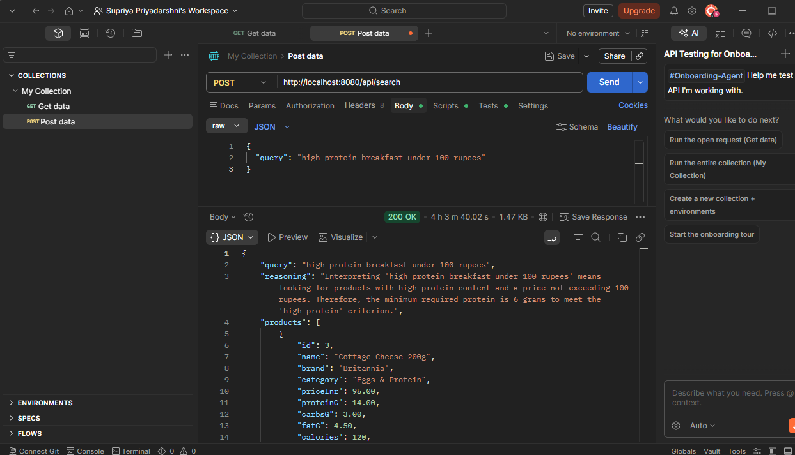

# Smart Grocery Assistant API

> **Java · Spring Boot · PostgreSQL · Redis · Ollama (Llama 3.2) · Docker**

REST API backend with natural-language product search — built to mirror real quick-commerce stacks (recommendation engines, LLM workflows, cached reads).

---

## Demo

`POST /api/search` with a natural language query:

```json
{
  "query": "high protein breakfast under 100 rupees"
}
```

Response:
```json
{
  "query": "high protein breakfast under 100 rupees",
  "reasoning": "Interpreting 'high protein breakfast under 100 rupees' means looking for products with high protein content and a price not exceeding 100 rupees. The minimum required protein is 6 grams to meet the 'high-protein' criterion.",
  "products": [
    {
      "id": 3,
      "name": "Cottage Cheese 200g",
      "brand": "Britannia",
      "category": "Eggs & Protein",
      "priceInr": 95.00,
      "proteinG": 14.00,
      "carbsG": 3.00,
      "fatG": 4.50,
      "calories": 120
    }
  ],
  "cached": false,
  "tookMs": 842
}
```

Same query again → `"cached": true`, `"tookMs": 0`

---

## Architecture

```
Client (Postman / curl)
        ↓
Spring Boot REST API
        ↓
┌───────────────────────────────┐
│  Service Layer                │
│  ├─ ProductService            │
│  └─ LlmService ───────────────┼──→ Ollama (Llama 3.2)
└───────────────────────────────┘
        ↓
   Redis Cache  (SHA-256 keyed, ~80% faster on repeat queries)
        ↓
   PostgreSQL  (200+ products, nutrition + categories)
        ↓
   Docker Compose (app + Postgres + Redis + Ollama)
```

**Design choice:** The LLM extracts *structured filters* (meal time, min protein, max price) as JSON. PostgreSQL is always the source of truth — the model never fabricates products.

---

## API Endpoints

| Method | Path | Description |
|--------|------|-------------|
| `GET` | `/api/products` | List all products |
| `GET` | `/api/products/{id}` | Get one product |
| `GET` | `/api/products/category/{name}` | Filter by category (e.g. `Dairy`) |
| `POST` | `/api/search` | **Natural language search** (LLM-powered) |
| `GET` | `/health` | Health check (DB + Redis status) |

---

## Quick Start

### Option 1 — Full Docker stack

```bash
docker compose up -d postgres redis ollama
docker exec -it grocery-ollama-1 ollama pull llama3.2
docker compose up --build api
```

### Option 2 — Local dev (no Docker for the app)

```bash
# 1. Start only the infrastructure
docker compose up -d postgres redis ollama

# 2. Pull the model (first time only)
docker exec -it grocery-ollama-1 ollama pull llama3.2

# 3. Run the app
mvn spring-boot:run
```

Requires JDK 17 and Maven installed locally.

### Option 3 — Without Redis (simplest)

Add to `src/main/resources/application.yml`:
```yaml
spring:
  cache:
    type: none
```

Then just start PostgreSQL and run the app. Search works fully — caching is skipped gracefully.

### Switch to OpenAI instead of Ollama

```env
LLM_PROVIDER=openai
OPENAI_API_KEY=sk-your-key
```

---

## Tech Stack

| Layer | Tool |
|-------|------|
| Language | Java 17 |
| Framework | Spring Boot 3.2 |
| Database | PostgreSQL 16 |
| Cache | Redis 7 |
| LLM | Ollama + Llama 3.2 |
| Migrations | Flyway |
| Containers | Docker + Docker Compose |

---

## Project Structure

```
src/main/java/com/grocery/assistant/
├── controller/   ProductController, SearchController, HealthController
├── service/      ProductService, LlmService, SearchService, SearchCacheService
├── repository/   JPA + custom filter queries
├── entity/       Product, Category
├── dto/          SearchRequest, SearchResponse, ProductDto, LlmFilterCriteria
├── config/       Redis, LLM properties, request logging
└── exception/    Global error handling

src/main/resources/
├── application.yml
├── application-docker.yml
└── db/migration/
    ├── V1__init_schema.sql    ← tables + GIN index on meal_tags
    ├── V2__seed_data.sql      ← 100 products
    └── V3__seed_more_products.sql  ← additional 100+ products
```

---

## Database Schema

- **categories** — Dairy, Grains, Snacks, Eggs & Protein, etc.
- **products** — name, brand, nutrition (`protein_g`, `carbs_g`, `fat_g`, `calories`), `meal_tags`, `price_inr`, stock
- GIN index on `meal_tags` using `to_tsvector` for fast full-text filtering
- 200+ products seeded automatically via Flyway on first boot

---

## Resilience

- If Ollama is down → keyword fallback rules kick in automatically, search still returns results
- If Redis is down → cache is skipped silently, search still works end-to-end
- LLM never invents products — DB is always source of truth

---

## Sample curl Requests

```bash
# Health check
curl http://localhost:8080/health

# All products
curl http://localhost:8080/api/products

# By category
curl http://localhost:8080/api/products/category/Dairy

# Natural language search
curl -X POST http://localhost:8080/api/search \
  -H "Content-Type: application/json" \
  -d '{"query": "high protein breakfast under 100 rupees"}'
```
